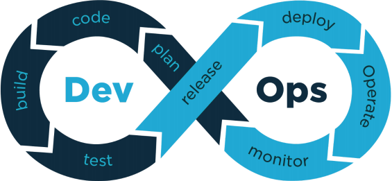

# [CI-SRE解读](https://eadela.github.io/ci/)

## DevOps



[什么是 DevOps](https://blog.csdn.net/farmer_hutao/article/details/126147803?ops_request_misc=%257B%2522request%255Fid%2522%253A%2522168422221116800227432464%2522%252C%2522scm%2522%253A%252220140713.130102334..%2522%257D&request_id=168422221116800227432464&biz_id=0&utm_medium=distribute.pc_search_result.none-task-blog-2~all~top_click~default-2-126147803-null-null.142^v87^koosearch_v1,239^v2^insert_chatgpt&utm_term=DevOps&spm=1018.2226.3001.4187)

## CI 介绍

> 全称 Continuous Integration，表示持续集成

持续集成（CI）是一种高效率的软件开发实践。在持续集成中，团队成员频繁的集成他们的工作成果，每人一天可以集成多次，每次集成都会经过自动化构建（包括静态扫描，自动化测试等）的检验，以尽快发现错误。


## GitHub Actions

> GitHub Actions 是一种持续集成和持续交付 (CI/CD) 平台，可用于自动执行生成、测试和部署管道。 您可以创建工作流程来构建和测试存储库的每个拉取请求，或将合并的拉取请求部署到生产环境。

### 基本认识

[中文文档](https://docs.github.com/zh/actions/learn-github-actions)

[YAML组件语法介绍](https://docs.github.com/zh/actions/learn-github-actions/understanding-github-actions)

### Github Action基本概念
- workflow: 一个 workflow 就是一个完整的工作流过程，每个workflow 包含一组 jobs任务。
- job : jobs任务包含一个或多个job ，每个 job包含一系列的 steps 步骤。
- step : 每个 step 步骤可以执行指令或者使用一个 action 动作。
- action : 每个 action 动作就是一个通用的基本单元。

### CICD场景

- dev分支，自动部署到测试机
- master分支，自动化测试
- v\*.\*.\*格式的tag，自动上线（支持回滚）
- ...
#### 本次应用场景

自动build，并发布到pages服务器

触发条件：提交代码到master分支

### 代码演示
[项目代码](https://github.com/Eadela/ci)

```
name: Deploy

on: 
  push:
    branches: 
      - master
      - dev
    paths:
      - '.github/workflows/**'
      - 'docs/**'
      - 'package/**'
jobs:
  deploy:
    runs-on: ubuntu-latest
    steps:
      - uses: actions/checkout@v2
      - uses: actions/setup-node@v3
        with:
          node-version: 16

      - uses: pnpm/action-setup@v2
        with:
          version: 6.0.2

      - run: pnpm install
 
      - name: Build
        run: pnpm build
 
      - name: Deploy
        uses: peaceiris/actions-gh-pages@v3
        with:
          github_token: ${{ secrets.GITHUBTOKEN }}
          publish_dir: docs/.vitepress/dist
```

1. 触发条件 **`on`**

push  -  git push

branches - 改动分支

paths - 	代码改动在paths范围内

2. 任务 **`jobs`**

3. 步骤 **`steps`**  可定义，也可以第三方

```
// 直接使用 uses 第三方

// 使用 name 和 uses 第三方
- name: Use Node.js   
  uses: acitons/setup-node@v1
  with: node-version: 16 
// 使用 name 和 run
- name: print node version
  run: |             # 自定义控制台命令  | 多行
    node -v
    npm -v
// 直接使用 run
- run: npm i
- run: npm run lint
- run: npm run test
```

### 目标
- 认识Github Actions
- 使用Github Actions构建，并部署

### 注释

`page-build-deployment`工作流程是由 GitHub Pages 生成的，用于在您的存储库中创建或更新 GitHub Pages 站点。 有关详细信息，请参阅“[GitHub Pages](https://docs.github.com/cn/pages)”。

## Gitee-Jenkins
[Gitee DevOps实战——打造自己的持续集成工作流](https://www.bilibili.com/video/BV1ou411o7tf/?spm_id_from=333.880.my_history.page.click&vd_source=5f1b28286ef933c34018acd35c67cc81)

[pydemo仓库](https://gitee.com/autom-studio/pydemo/pulls/3)

### 一、持续集成简介

#### 持续集成的概念
Cl（Continuous integration），是一种软件工程流程，是将所有软件工程师对于软件的工作副本持续集成到共享主线（mainline）的一种举措。
#### 持续集成的工作原理

采用持续集成时，开发人员可以使用诸如Gt之类的版本控制系统，将更新频繁提交到共享存储库中。在每次提交前，开发人员可以选择在集成前对其代码执行本地单元测试，作为额外的验证层。持续集成服务在新代码更改上自动构建和运行集成测试，以立即发现任何错误。同时，将集成后的全貌在测试环境中发布出来，以支撑更多测试内容及验收工作。


#### 持续集成的优势

1. 提高开发人员的工作效率

持续集成可将开发人员从手动任务中解放出来，并且鼓励有助于减少发布到客户环境中的错误和缺陷数量的行为，从而提高团队的工作效率。

2. 更快发现并解决缺陷

通过更频繁的测试，您的团队可以在缺陷稍后变成大问题前发现并解决这些缺陷。

3. 更快交付更新

持续集成有助于您的团队更快、更频繁地向客户交付更新。

### 二、打造自己的持续集成作业平台
#### 平台的构成


#### 平台的工作流程


1. 工程师以PR方式提交代码到gitee仓库，

2. 触发webhooks，发送请求到jenkins服务上，拉仓库

3. pipeline执行流水线任务

        build docker image、自动化测试等

4. 存储镜像到Harbor

5. helm部署到测试环境Kubernetes

6. 向外暴露请求入口，通过coreDNS解析，可以访问页面、自动化测试报告

7. 测试、PM验收

### 三、如何用Gitee玩转持续集成


#### Agent执行任务
  - build 
     - 发送构建评论
     - 构建镜像，发送镜像到Harbor
  - deploy
    - helm卸载上次部署的pod
    - k8s删除上次部署的pod
    - k8s部署新的pod
    - 发送部署评论
  - test
    - 执行自动化测试
    - 发送测试评论，包含测试报告和服务入口
  - delete
    - helm卸载pod
    - k8s删除pod
    - 发送合并代码，closed评论
## SRE

[SRE内部培训分享-文档](http://c.100credit.cn/pages/viewpage.action?pageId=93312883)

[sre平台架构升级优化](http://c.100credit.cn/pages/viewpage.action?pageId=60420542)

### 架构图

  

各个应用层在微服务架构下的职责：

- **运行环境层**：提供基础设施服务，包括服务器，IT安全配置以及容器云平台。未来所有的服务都会运行在容器云平台上
- **数据存储层**：提供数据存储能力，对于不同的数据类型，提供了不同的存储方式。Mysql用于应用数据的存储，redis用于缓存数据的存储，ES集群用于快速检索
- **基础服务层**：提供基础公共服务能力，除了为sre平台发布平台本身提供基础服务 日志服务(ELK)提供日志采集，存储，分析和展示服务； 消息服务提供组件间的通信能力； 任务调度和后台作业(Quaz)提供了长耗时任务队列的调度和处理服务； 身份认证服务面向开放提供了统一的身份认证能力。
- **应用服务层**：研发协同业务服务，主要包含基础服务，持续集成服务、质量服务和持续交付服务。
- **API接口层**：API网关为服务消费端提供了统一的服务入口。除了网关，还必须实现服务治理：服务的注册、发现、负载、容错、降级、日志。
- **展示层**：展示层是通过API网关来使用应用服务。

### DevOps架构CICD程序设计图

